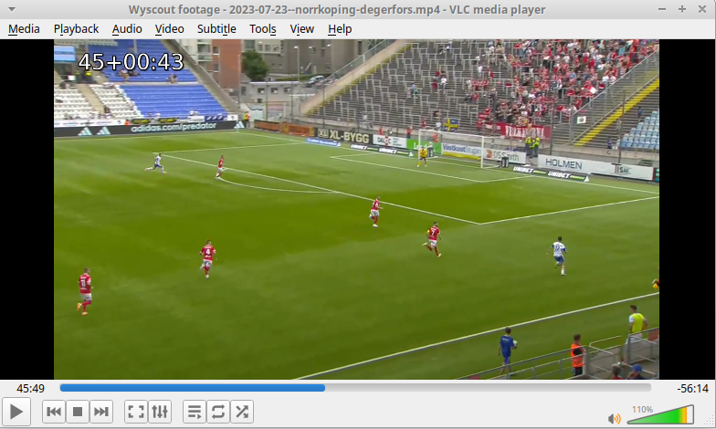

# Football gametime VLC extension

_Developed by [pdpino](https://github.com/pdpino)_

Show the gametime in a football match in the top left corner of the video.
You need to save the kick off times for each video.


## Table of Contents

- [Setup](#setup)
  - [Automatic installation](#automatic-installation)
  - [Manual installation](#manual-installation)
- [Usage](#usage)
  - [Open VLC](#open-vlc)
- [Examples](#examples)

## Setup

Choose to install automatically (recommended) or manually.

### Automatic installation

* Linux (tested in Xubuntu 22.04) - run the following in a terminal:
    ```bash
    bash ./setup/linux/install.sh
    ```
* Windows: TODO
* Mac: not available, follow the manual installation


### Manual installation

Follow the manual installation for [Linux](./docs/linux.md#manual-installation), [Windows](./docs/windows.md#manual-installation) or [Mac](./docs/mac.md).

**Disclaimer: I haven't tested in Mac, instructions are incomplete.**


## Usage

### Open VLC

Open VLC with the interface enabled by searching in your apps _"VLC with football gametime"_ or clicking the desktop shortcut.

<details>
<summary>
Note: if you cannot find the shortcut...
</summary>
Try opening VLC manually using the instructions for your OS: [Linux](./docs/linux.md#running-vlc-from-the-terminal), [Windows](./docs/windows.md#running-vlc-manually) or [Mac](./docs/mac.md).
</details>
<br/>


Then, click _View_ -> _Football Gametime_ and save the kick off times for first and second halves.
The gametime should be displayed at the top left corner of the video.
You only need to save the kick off times once for each file (unless you change the name of the file).


## Examples





